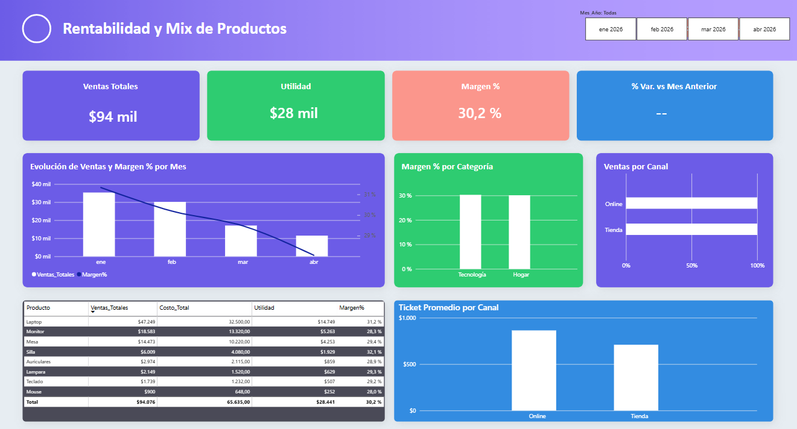

# Rentabilidad y Mix de Productos - Dashboard en Power BI

Analisis de rentabilidad de ventas por producto, categoria y canal, construido en Power BI con un modelo de datos relacional y medidas DAX desde cero.

## Objetivo del analisis

No alcanza con saber cuanto se vendio, hay que saber que tan rentable es lo que se vende y en que canal. Este dashboard responde tres preguntas de negocio:

- Cual es la evolucion de ventas y margen de ganancia mes a mes?
- Que categoria de producto y que canal de venta son mas rentables?
- Que productos individuales conviene priorizar?

## Principal hallazgo

El canal Online genera un ticket promedio mas alto que la venta en Tienda fisica. Esto sugiere que, aunque ambos canales mueven un volumen de ventas similar, cada transaccion online representa un valor mayor, un dato relevante para decisiones de inversion en marketing digital vs. presencial.

## Estructura del dashboard

| Seccion | Que muestra |
|---|---|
| KPIs principales | Ventas Totales, Utilidad, Margen %, Variacion vs. mes anterior |
| Evolucion mensual | Ventas y Margen % combinados en un mismo grafico |
| Margen % por Categoria | Comparacion de rentabilidad entre Tecnologia y Hogar |
| Ventas por Canal | Volumen de ventas, Online vs. Tienda |
| Ranking de productos | Tabla con Ventas, Costo, Utilidad y Margen % por producto |
| Ticket Promedio por Canal | Valor promedio de cada transaccion, por canal |

Incluye un segmentador de Mes/Anio para explorar el desempeno en distintos periodos.

## Dataset

- Fuente: registro de ventas de 8 productos (categorias Tecnologia y Hogar) en 6 ciudades de Italia, enero-abril 2026
- Volumen: 120 transacciones
- Tablas: Ventas (hechos), Productos (dimension), Calendario (dimension, generada en DAX)

## Proceso tecnico

### 1. Limpieza de datos (Power Query)
Verificacion de tipos de datos, consistencia de texto y ausencia de duplicados en ambas tablas de origen.

### 2. Modelado de datos
Modelo en estrella: tabla de hechos Ventas relacionada 1 a muchos con dos dimensiones, Productos y Calendario. Esta ultima se construyo en DAX con CALENDAR() para tener control total sobre las columnas de tiempo (Anio, Mes, Trimestre, dia de la semana, y columna de fin de mes con EOMONTH()).

### 3. Medidas DAX

| Medida | Funcion principal | Que calcula |
|---|---|---|
| Ventas Totales | SUM | Suma de ventas |
| Costo Total | SUMX + RELATED | Costo total trayendo precio unitario desde Productos |
| Utilidad | Resta entre medidas | Ventas Totales menos Costo Total |
| Margen % | DIVIDE | Utilidad / Ventas Totales, con manejo de division por cero |
| Ventas Canal Online | CALCULATE | Ventas filtradas al canal Online |
| Ticket Promedio | AVERAGE | Valor promedio por transaccion |
| Cantidad de Pedidos | COUNTROWS | Numero de transacciones |
| Ventas Mes Anterior | CALCULATE + PREVIOUSMONTH | Time intelligence |
| % Variacion vs Mes Anterior | DIVIDE | Crecimiento o caida relativa mes a mes |

### 4. Diseno visual
El layout se planifico como wireframe en PowerPoint y luego se importo como fondo en Power BI, sobre el cual se construyeron los visuales con fondo transparente, la misma tecnica que usan equipos de BI para separar el diseno del desarrollo.

## Herramientas utilizadas

Power BI Desktop, Power Query, DAX, PowerPoint (diseno de wireframe)

## Proximos pasos

El dataset incluye una dimension geografica (6 ciudades) que no se exploto en esta version, queda como ampliacion natural para un analisis de rentabilidad por region.

---

Este proyecto forma parte de mi portfolio de analisis de datos.
